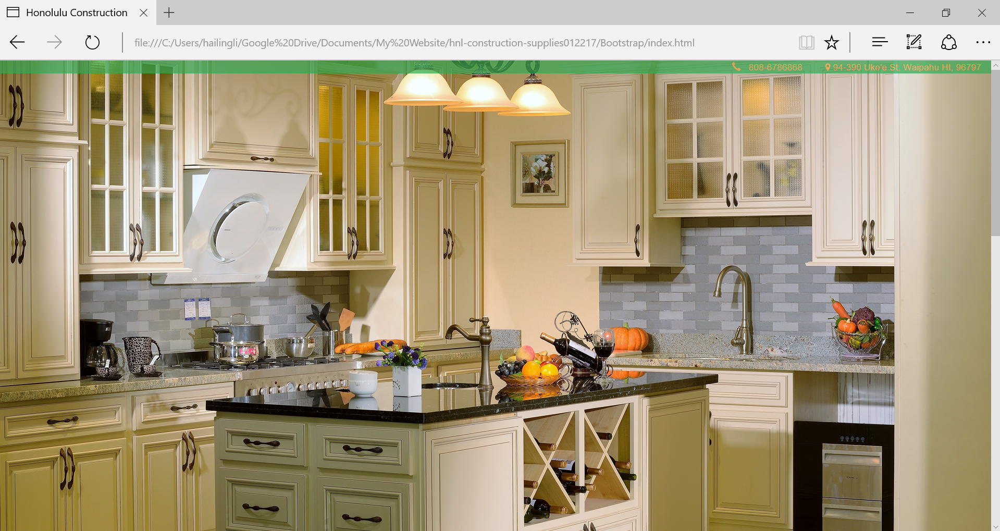

Honolulu Construction Supplies is My dad’s business in Waipahu, Hawaii. This website is the first mobile friendly website. The code was written in html, CSS and JavaScript. It also invokes JQuery, and Bootstrap UI design. Even though it’s a one page website. It contains the main information needed for people to know about the company. 

I was the only developer of this website. This website was not a modification of other sites. I started completely from scratch. In fact, I didn’t learn bootstrap before doing this. I was totally doing while learning. During this learning process, YouTube was my best friend. And
I also applied what I learnt from online courses.

It might not be the greatest project, but I’ve learnt a lot from this experience. In this project, I taught myself how to be a self-directed learner. I improved my project management skill. I learnt how and where to effectively search for coding problems.

The code is available in [GitHub](https://github.com/hailing-li/HCS-Bootstrap-Site).

